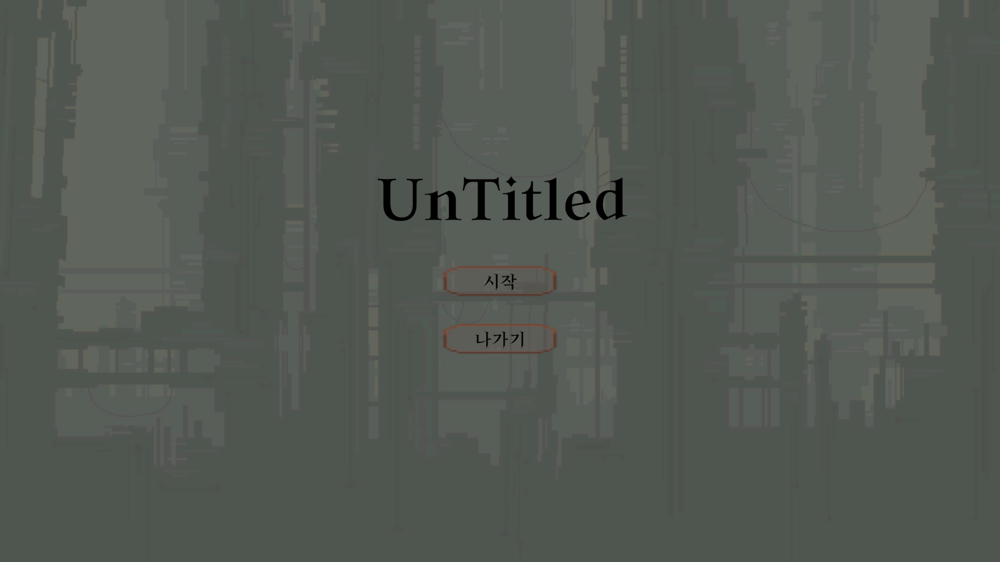
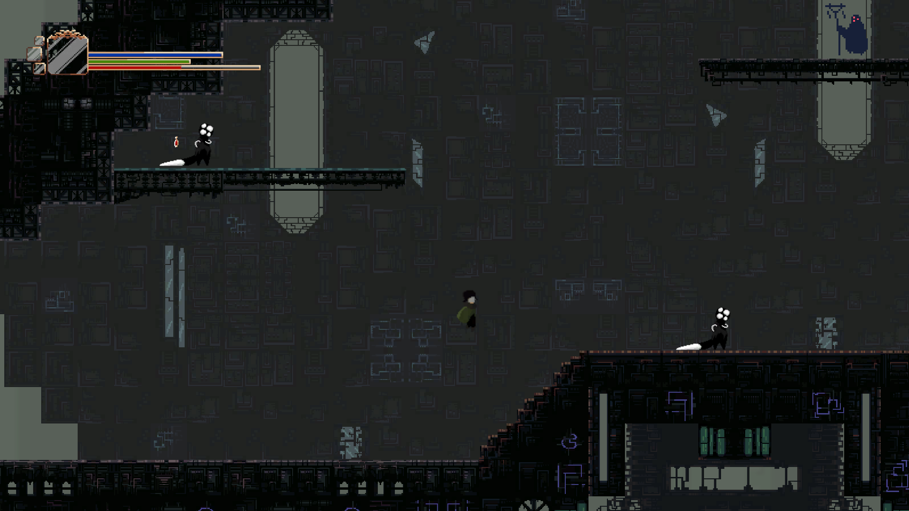

순서: 

	1. 써야 할 에셋 찾기(배경, 캐릭터, 적, 아이템)

	2. 배경 구현

	3. 메인 캐릭터의 기본적인 움직임, Animator, 기본공격, 히트박스 구현

	4. 카메라 구현(캐릭터를 따라다니는 카메라)

	5. 맵 짧게 구현

	6. GUI의 캐릭터의 HP

	7. 적의 기본적인 움직임, Animator, 기본공격, 히트박스, 메인 캐릭터 감지

	8. 메인 캐릭터가 주는 데미지 구현, 적이 주는 데미지 구현

	9. 메인 캐릭터의 HP회복 구현

	10. 적의 아이템 드랍

	11. GUI의 마석에 개수 구현

	12. GUI의 캐릭터의 맞았을 때와 힐이 됬을 때의 글씨 구현

	13. 힐 아이템과 스킬 아이템 구현

	14. 컷신 구현

	15. 대사 구현

	16. 메인 캐릭터가 스킬이 있다는 것을 띄우는 GUI 구현

	17. 적이 메인 캐릭터를 발견 했다는 것에 대한 GUI 구현

	18. 메인 캐릭터의 스킬 구현

	19. 적의 스킬 구현

	20. 전투 구현(산나비 처럼 적을 전부 죽여야만 나아갈 수 있도록)

	21. GUI의 ESC창과 첫 게임 창 구현

	22. Adio 구현(전투, 비전투, 공격, 아이템 등 전부)

	23. 맵 전부 구현

	24. 보스 구현(전부)

	25. 엔딩 구현

	26. 최적화

그룹:
	
	배경:
	1. 뒷 배경 구현
	2. 캐릭터와 상호작용이 되는 땅의 기본 구현
	3. 맵 구현

	카메라:
	1. 캐릭터를 따라 다니는 카메라 구현
	2. 컷 신이 진행 될 때의 카메라 구현

	캐릭터:
	1. 메인 캐릭터 Animator에 기본적인 움직임(ex: Idle, Walk, Run, Jump등)
	2. 메인 캐릭터의 기본 공격 구현(좌클릭의 기본적인 공격과 점프 했을 때의 공격)
	3. 메인 캐릭터가 스킬을 쓸 때의 Animator 구현
	4. 메인 캐릭터의 히트박스, 공격 히트박스
	5. 메인 캐릭터가 주는 데미지 구현
	6. 메인 캐릭터가 받는 힐의 구현
	|
	1. 적의 기본적인 Animator 구현(움직임 등)
	2. 적의 움직임 구현(산나비, 스컬의 적 움직임)
	3. 적의 기본 공격
	4. 적의 스킬 공격(모두에게 있는 공격은 아니다)
	5. 적의 아이템 드랍(적을 잡았을 때의 아이템 드랍)
	6. 적의 히트박스
	7. 적의 메인 캐릭터의 확인 범위
    8. 적이 주는 데미지 구현

	아이템:
	1. 힐 아이템(캐릭터와 상호작용이 됬을 때 캐릭터의 HP가 회복이 된다)
	2. 스킬 아이템(캐릭터가 일정 이상의 드랍 템을 모았을 때 얻어진다)

	GUI:
	1. 캐릭터의 HP를 눈에 보이게 띄움
	2. 캐릭터의 스킬을 눈에 보이게 띄움
	3. 메인 캐릭터의 마석 개수 구현
	4. 데미지에 대한 공격을 받았다는 글씨 구현
	5. 힐에 대한 HP가 회복 되었다는 글씨 구현
	6. 적이 메인 캐릭터를 발견 했을 때의 글씨 구현
	7. ESC를 눌렀을 때 나오는 화면(계속하기, 나가기, 옵션 등 [이 때는 게임이 멈춰야 한다])
	8. 게임을 처음 켰을 때의 화면(새 게임, 이어하기, 옵션 등)

	Adio:
	1. 아무것도 하지않고 있을 때의 오디오 구현
	2. 공격, 움직임, 맞을 때 등의 오디오 구현
	3. 전투 할 때의 오디오 구현

	에셋:
	1. 배경
	2. 캐릭터
	3. 적
	4. 아이템
	5. 오디오

	전투:
	1. 잠겨있는 전투(적을 전부 잡기 전까지 나가지 못하게 막는 전투방식)
	2. 가능 하다면 적을 전부 잡으면 다시 적이 생기는 2페이지 같은 느낌으로

------------------------------------

    게임 제목: 미정
    개발 기간: 2024 01/4 ~ 02/ 15(계속 발전시킬 예정)
    개발 인원: 1인
    개발 역할: 전부
    사용한 엔진: Unity
    사용한 언어: c#
    플랫폼: PC

    게임 장르: 현 엑션(스토리, 로그라이크로 변경 예정)
    게임 핵심 특징: 정해진 길로 이동하다가 특정 위치에 갇혀 적과 싸우고 전부 처치 했을 시에
    열리는 시스템

    게임 플레이 방식: 플레이어가 달리기 점프 슈퍼점프를 사용하며 정해진 길로 이동하는 도중에 
    특정 위치에 도착하면 갇혀진 후에 갇힌 상태에서 적을 전부 잡을 시에 나가지는 방식

    
    개발한 기능:
    갇혀 하는 전투, 플레이어 공격의 돌진, Way포인트로 움직이는 적, 순간이동 하는 적, 슈퍼점프

    사용한 기술: LSP, DIP

    어려웠던 점 및 해결 과정: 어려웠던 점은 꽤 많이 있었다.
    1. 에셋 구하기: 내가 만드려는 게임에 맞는 에셋을 찾아야 하는데 잘 보이지 않아서 꽤 고생을 했다.
    2. 아이디어: 여기서 어떻게 해야 더 좋을 지를 생각을 하는데 잘 떠오르지 않아서 시간을 꽤 썼다.
    3. 디자인: 혼자 전부 해야하기 때문에 꾸미기라는 것을 해본 적이 거의 없는 나의 입장으로써는 꽤 힘들었다.
    4. 코드짜기: 내가 만드려고 하는 방식이 학원에서 배운 것과는 다른 것들이 많기 때문에 코드를 짜려고 해도 모르겠는 경우가 허다했다.
    5. 코드 정돈: 처음에는 정리가 되어 있었지만 가면 갈수록 더러워 졌고 보기도 힘들어졌다.
    6. 정신 관리: 버그가 많이 걸리고 안되는게 많아지면 많아질수록, 생기면 생길수록 머리속이 어지러워 져서 하나를 하기도 힘들어져 쉬기에 바빴다.
    해결 과정
    1. 에셋은 선생님에게 물어봐 사이트를 구했고 거기서 찾는거는 내가 하긴 했지만 사이트를 알아서 매우 편해졌다.
    2. 아이디어는 친구들, 가족에게 조언을 구할 때도 있엇으며 산책을 하거나 쉬면서 아이디어에 대한 생각을 하니 전 보단 잘 떠올랐다.
    3. 디자인은 시간을 좀 투자하여 노력을 좀 해서 완성 시킨 뒤에 그림을 잘 그리는 친구들에게 말을 구했다.
    4. 코드를 짜는 것은 모르는게 나올 때는 강사님과 Chat GPT의 도움을 전적으로 받았다.
    5. 코드 정돈은 아직 고쳐지지 않았지만 해결 방법은 이미 쓴 코드에 다른 것들을 적을 때 반드시 순서를 지키는 것이라고 생각한다.
    6. 정신 관리는 힘들 때마다 친구들에게, 가족에게 하소연 하거나 노래들으며 쉬기 친구들과 대화하기, 산책하기등의 방법으로 머리를 식혔다.

    개발 과정에서 얻은 것:
    프로그래밍을 하는데에 사소해 보이는 것에도 꽤 많은 노력이 들어가며 처음 만들어 보는 게임에 방식이다 보니
    더 많은 코딩 지식들이 머리속으로 들어왔다. 또 시간이 생각보다 훨씬 많이 필요하며 정신 관리도 해야 한다는 것을
    배웠다. 이번에 게임을 만드는 과정중에는 얻은 것 밖에 없었다. 처음 하는 것 이였다 보니 모르는 것 투성이이기도 했으며
    처음 해본 도전이 였기 때문에 개발 과정에서 나는 잃은것, 정채된 것 없이 계속해서 발전했다.
    
    나 자신의 보완할 점:
    나 자신은 시간이 많음에도 불구하고 나의 해야할 것을 안 하며 게임을 많이 했다는 것에 대해서 바꿔야 한다고 생각한다.
    나는 하루에 최소 4시간은 코딩을 하는데 이정도는 매우 적었다. 나는 재능이 있지 않다는 것을 알기에 더욱 열심히 시간을
    많이 써야 한다는 것을 알고 있었음에도 불구하고 나 자신의 쾌락을 위해서 게임을 했다. 그렇게 처음에는 평균 6시간이였던
    나의 코딩 시간이 2시간이나 줄어들었음을 깨달았다. 그러새 오늘부터는 다짐한다. 하루에 최소 8시간은 코딩으로 채우겠다고.

    게임의 개선할 점: 나는 이 게임을 정식으로 포트폴리오로 쓸 생각을 하고 있이게 내가 생각하고 있는 게임의 반도 안돼어 있어서 계속해서
    업데이트를 할 것이다. 예를들어 위에 적어놨듯이 개발 기간에 계속 발전시킬 예정과 게임 장르에 스토리, 로그라이크로 변경 예정
    이라는 것은 내가 처음에 구상했으며 내가 만들 게임의 진짜 구상이기 때문에 저것들에 맞춰서 게임을 만들어 나갈 것이다.
    
    

    
    
    

